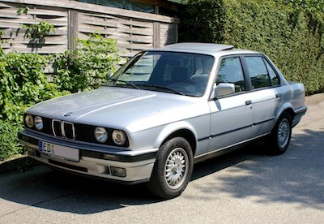
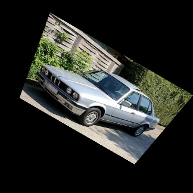

# Manually Computing a Perspective Transformation Matrix
Python function to manually compute a perspective transform matrix from the given rotations  (around the z-axis) and  (around the x-axis) in the camera frame.

The resulting 3x3 transform matrix can then be plugged into OpenCV and Tensorflow using `cv2.warpPerspective` and `tf.contrib.image.transform`.

    <table align="center">
	    <tr>
            <td style="padding:5px">
        	    
      	    </td>
            <td style="padding:5px">
        	    
      	    </td> 
        </tr>
        <tr>
            <td align="center" style="border-top: none">Original</td>
            <td align="center" style="border-top: none">Transformed</td>
        </tr>
    </table>

The code on this repository was inspired by this [post](https://stackoverflow.com/questions/17087446/how-to-calculate-perspective-transform-for-opencv-from-rotation-angles%22%22%22) on Stack Overflow.

## How it works
The perspective matrix is computed using the pinhole camera model:

	

It assumes the same horizontal and vertical field of view for the camera model, which results in a square image.

The coordinates of the image are first converted to the camera frame. Both  and  rotations are then applied in the camera frame. Lastly, the image pane is set as close to the image as possible while still allowing room for any image rotation.

For more details, refer to my code implementation and to the Stack Overflow post linked above.